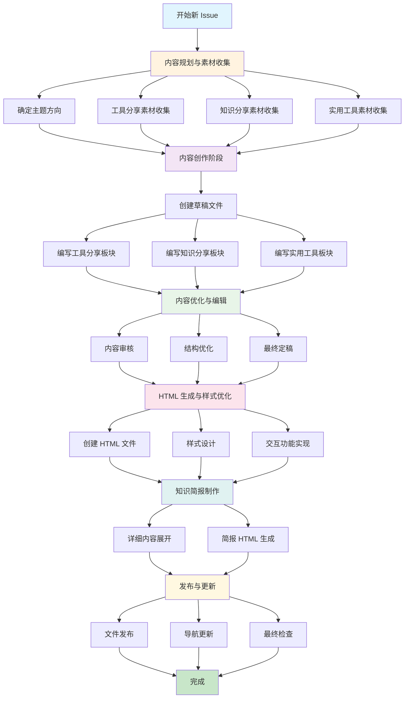

# Digital Garden Issue 生成工作流程图

## 工作流程图

## 阶段说明

### 🔍 阶段1：内容规划与素材收集

- **输入**：创意想法、研究方向
- **输出**：完整的素材库和内容大纲
- **关键活动**：
  - 工具测试和截图
  - 论文阅读和要点提取
  - 实用工具验证

### ✍️ 阶段2：内容创作

- **输入**：素材库和内容大纲
- **输出**：完整的 Markdown 草稿
- **关键活动**：
  - 按标准结构编写内容
  - 添加图片和链接
  - 确保内容深度和价值

### 🎨 阶段3：内容优化与编辑

- **输入**：Markdown 草稿
- **输出**：优化后的最终文档
- **关键活动**：
  - 内容审核和校对
  - 结构优化
  - 格式统一

### 💻 阶段4：HTML 生成与样式优化

- **输入**：最终 Markdown 文档
- **输出**：现代化的 HTML 页面
- **关键活动**：
  - 响应式设计
  - 交互功能实现
  - 样式优化

### 📄 阶段5：知识简报制作

- **输入**：知识分享板块内容
- **输出**：详细的知识简报
- **关键活动**：
  - 内容深度展开
  - 独立 HTML 页面生成

### 🚀 阶段6：发布与更新

- **输入**：所有文件
- **输出**：发布的 Issue
- **关键活动**：
  - 文件发布
  - 导航更新
  - 质量检查

## 质量控制点

### ✅ 内容质量检查点

1. **素材收集阶段**：确保工具经过实际测试
2. **内容创作阶段**：确保每个板块都有深度
3. **优化编辑阶段**：确保语言表达清晰准确
4. **发布前检查**：确保所有链接和图片正常

### ✅ 技术质量检查点

1. **HTML 生成阶段**：确保结构语义化
2. **样式优化阶段**：确保响应式设计
3. **功能实现阶段**：确保交互功能正常
4. **发布前测试**：确保跨浏览器兼容

### ✅ 用户体验检查点

1. **设计阶段**：确保界面美观现代化
2. **功能阶段**：确保交互流畅直观
3. **测试阶段**：确保移动端体验良好
4. **发布阶段**：确保导航清晰易用

## 时间估算

| 阶段 | 预估时间 | 关键任务 |
|------|----------|----------|
| 素材收集 | 2-3小时 | 工具测试、论文阅读 |
| 内容创作 | 3-4小时 | 草稿编写、结构搭建 |
| 优化编辑 | 1-2小时 | 内容校对、格式优化 |
| HTML生成 | 2-3小时 | 样式设计、功能实现 |
| 简报制作 | 1-2小时 | 内容展开、独立页面 |
| 发布更新 | 0.5-1小时 | 文件发布、链接更新 |
| **总计** | **9-15小时** | **完整 Issue 制作** |

## 成功标准

### 📊 内容指标

- [ ] 三个板块内容完整且有价值
- [ ] 工具经过实际测试验证
- [ ] 知识分享有深度见解
- [ ] 所有外部链接有效

### 🎯 技术指标

- [ ] HTML 页面加载快速
- [ ] 移动端显示正常
- [ ] 交互功能稳定
- [ ] 跨浏览器兼容

### 👥 用户体验指标

- [ ] 界面美观现代化
- [ ] 导航清晰直观
- [ ] 内容易于阅读
- [ ] 功能易于使用

---

*此工作流程图基于 Digital Garden 第2期的成功实践制定，可根据实际需要调整和优化。*
