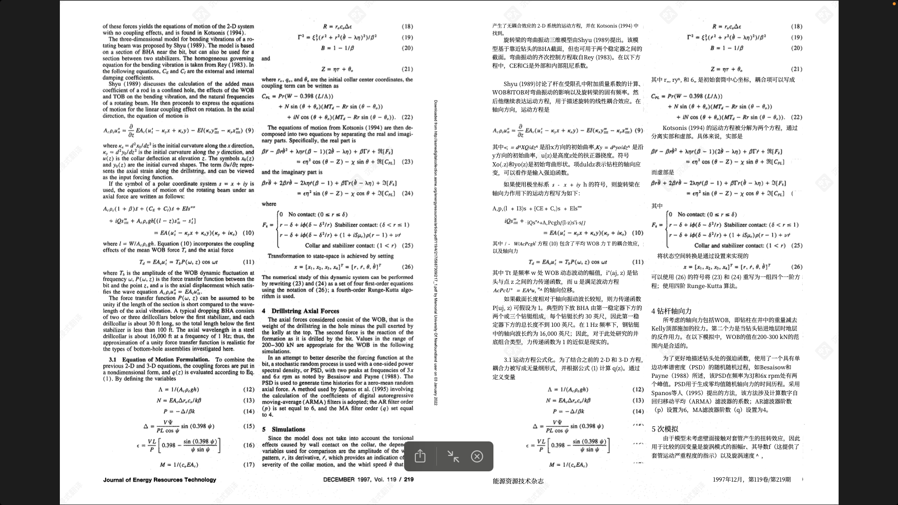
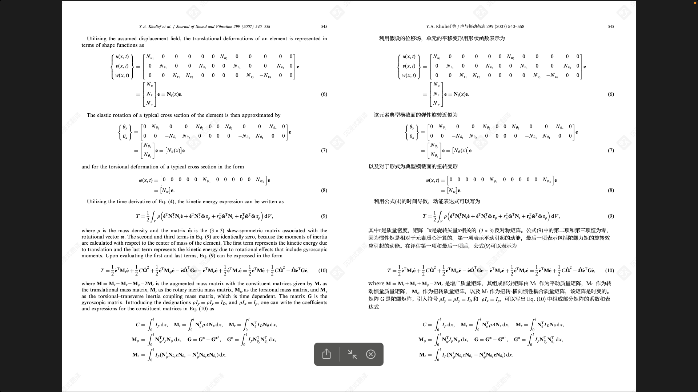
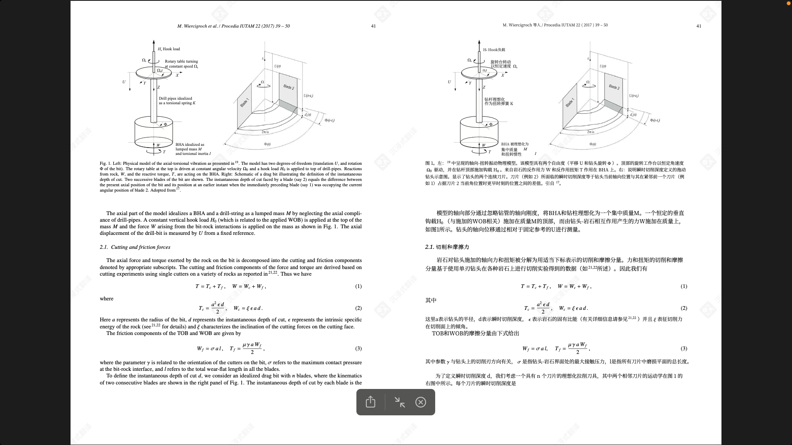
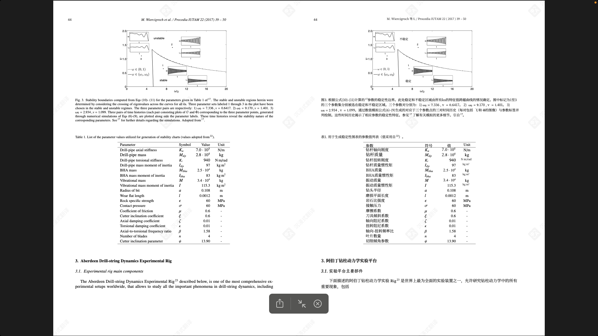

# Digital Garden 第2期

## 工具分享：PDFMath Translate

**简介**：PDFMath Translate 是一款开源免费的 PDF 翻译工具，专为学术论文和科技文档设计。

### 核心特性

- **布局一致性**：翻译后完美保留原文档的布局结构
- **内容完整性**：完整保留公式、图表、目录、注释等所有结构化信息
- **多引擎支持**：集成多种翻译引擎，提供高质量的翻译服务
- **界面友好**：提供简洁易用的在线界面，操作简单直观

### 使用体验

用户可以直接访问项目的 GitHub 主页，找到在线服务链接，上传需要翻译的论文即可开始翻译。经过实际测试，该工具的翻译效果令人印象深刻：

### 使用建议

虽然该工具在保持布局一致性方面表现出色，但需要注意以下几点：

- 公式及其参数在翻译过程中可能会有细微变化
- 专业术语的翻译可能存在一定偏差
- 建议对关键专业内容进行人工校对

**项目链接**：[PDFMath Translate GitHub 仓库](https://github.com/Byaidu/PDFMathTranslate?tab=readme-ov-file)

---

## 知识分享：卫星与人工智能绘制隐藏的海上工业世界

### 研究背景

最近发表的一项科学研究利用卫星雷达图像、GPS 数据和深度学习模型，对全球海洋工业活动进行了前所未有的详细测绘。

### 主要发现

#### 未被记录的海上活动

研究发现，全球海洋工业活动中存在大量"隐形"操作：

- **工业捕鱼船只**：约 72% 至 76% 的船只未被公共跟踪系统记录
- **运输和能源船只**：很大一部分同样缺乏官方记录
- **地域分布**：南亚、东南亚和非洲周边地区是主要盲区

#### 行业变化趋势

- **捕鱼活动**：全球范围内呈现下降趋势，COVID-19 大流行期间尤为明显
- **海上风能**：基础设施快速发展，自 2017 年以来数量增加一倍以上
- **产业结构**：海上工业活动的构成正在发生显著变化

### 研究意义

这项研究通过以下方面提供了更准确的海洋工业化全球视图：

- 发现此前未被识别的活动热点
- 提供更高分辨率的海洋使用模式
- 相比传统 AIS 跟踪系统，数据覆盖更加全面

**详细报告**：查看完整的[论文简报](./satellite-mapping.md)，深入了解科学家如何利用卫星和 AI 技术绘制隐藏的海上工业世界。

**原文链接**：[Nature 期刊论文](https://www.nature.com/articles/s41586-023-06825-8)

---

## 实用工具：纽芬兰圣约翰斯租房地图（更新版）

### 项目简介

这是一个基于 Kijiji 租房信息爬虫项目生成的交互式租房地图，已在第一期 Digital Garden 中介绍过。

### 功能特点

- **实时数据**：定期更新最新的租房信息
- **交互式界面**：支持地图浏览和房源筛选
- **地理位置**：专注于纽芬兰圣约翰斯及其周边城市

### 使用方式

直接访问地图网站，即可查看最新的租房信息：

**地图网址**：<https://greattyrion.github.io/localRentalPlace/>

---

*本期 Digital Garden 就到这里，感谢您的阅读！*
