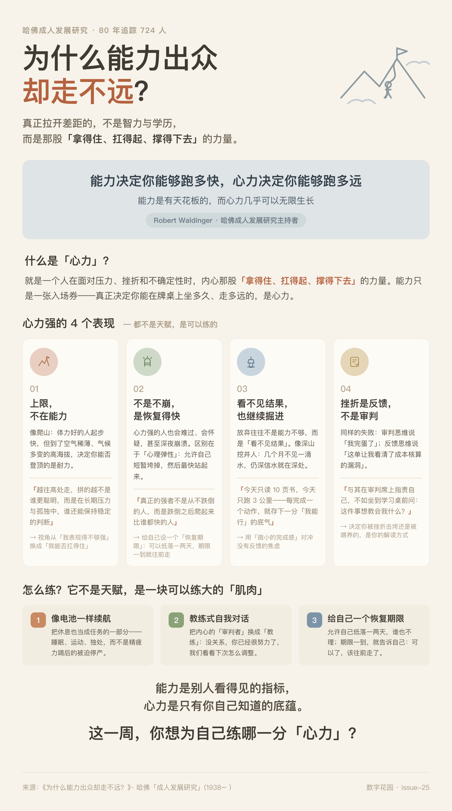

# 为什么能力出众却走不远？哈佛 80 年研究：真正拉开差距的，是这 4 个字

你身边是否有这样的人？论能力，他们并非顶尖；论学历，不算出众；论天赋，也谈不上惊艳。可偏偏是他们，在充满不确定性的职场长跑中，一步步走到了别人望尘莫及的高度。

与之形成鲜明对比的，是我们常看到的“高开低走”的人生：有些人聪明、有才华、履历漂亮，却总在关键时刻掉链子。一遇压力就崩盘，一遭挫折就“摆烂”，一被否定就陷入无底洞般的自我怀疑。尤其在如今高压的竞争环境下，这种现象愈发普遍。

这种人生走向的巨大反差，究竟是由什么决定的？

为了解开这个困惑，哈佛大学开展了一项史上跨度最长的研究——“成人发展研究（Study of Adult Development）”。从 1938 年开始，研究者们追踪了 724 个人整整 80 多年。主持该研究的哈佛大学教授尔丁格（Robert Waldinger）发现：决定一个人一生高度的，从来不是智力、学历这些显性的能力指标，而是一个更隐蔽的核心变量——“心力”。

所谓心力，就是一个人在面对压力、挫折和不确定性时，内心那股**“拿得住、扛得起、撑得下去”**的力量。

---

## 1. 能力决定你的下限，而心力决定你的上限

在任何行业，能力都只是一张“入场券”，让你有资格站上高阶玩家的牌桌。但真正决定你能在牌桌上坐多久、走多远的，是你的心力。

这就像爬山。体力好的人起步可能冲得很快，但到了空气稀薄、气候多变的高海拔处，决定你能否登顶的不再是爆发力，而是在极端环境下一步一步往上走的耐力。越往高处走，拼的越不是谁更聪明，而是在长期的压力与孤独中，谁还能保持稳定的判断。

> 能力决定你能够跑多快，心力决定你能够跑多远。

能力是有天花板的，而心力几乎可以无限生长。当我们把注意力从“我表现得不够强”转变为“我能否扛得住”时，这种视角的切换，往往就是人生向上突破的关键转折点。

---

## 2. 心力不是“永不崩溃”，而是“恢复得更快”

我们常常误以为强者就是铁打的，从不脆弱。哈佛研究告诉我们：事实恰恰相反。

心力强的人也会难过、会怀疑，甚至会在深夜里感到彻底崩溃。但他们与普通人的区别在于**“心理弹性（Elasticity）”**。普通人被打击后，可能消沉数月，陷入失眠与自我否定的恶性循环；而心力强者允许自己短暂地“垮掉”，他们会哭、会沮丧、甚至允许自己适当“摆烂”。但崩溃完擦干眼泪，他们重新站起来的速度比谁都快。

物理学中，僵硬的东西一碰就断，有弹性的东西压下去还能弹回来。

- **实操建议**：给自己设定一个“恢复期限”。允许自己低落一两天，谁也不理。但期限一到，就要告诉自己：“可以了，该往前走了。”

> 真正的强者不是从不跌倒的人，而是跌倒之后爬起来比谁都快的人。

---

## 3. 在没有反馈的黑夜里，依然能坚持掘进

大多数人选择放弃，真相往往不是因为能力不够，而是因为“看不见结果”。

人类天生渴望即时反馈，如果一件事做了许久却没有回响，大脑会本能地诱导我们逃避。而心力强的人拥有一种稀缺的“延迟满足”信念。他们像深山里的挖井人，即便前几个月看不到一滴水，但他们深信水就在深处。

这种内心的光，不是别人点亮的，而是自己一次次熬过黑暗攒下的。为了对冲焦虑，我们可以将大目标拆解为**“微小的完成感”**：

- 今天只读 10 页书。
- 今天只跑 3 公里。
- 今天只把那件拖延已久的小事处理掉。

每完成一个动作，你就在心里为自己存下了一分“我能行”的底气。

---

## 4. 将挫折视为“反馈”，而非“审判”

哈佛研究中有一个反复出现的模式：面对同样的失败，两种思维模式决定了截然不同的命运。

- **审判思维（心力弱者）**：将失败解读为对人格的审判。一笔生意亏了，他们想的是：“我完蛋了，我这辈子不适合做生意”，从此畏首畏尾。
- **反馈思维（心力强者）**：将失败解读为信息。同样是生意亏损，他们想的是：“这一单让我看清了成本核算的漏洞，亏这一次，换来的是以后不再犯错。”

决定你被挫折击垮还是被挫折喂养的，从来不是挫折本身，而是你的解读方式。与其在审判席上指责自己，不如坐到学习桌前问一句：“这件事想教会我什么？” 这一念之差，能让你从自我否定的深渊走向自我升级的台阶。

---

## 5. 找回内心的“锚”，与不确定性共处

让很多人内心崩溃的，往往不是困难本身，而是那种“不知道结果会怎样”的悬而未决。心力弱的人需要万事皆在掌控才能心安，而心力强的人则能与不确定性长期共处。

这种底气源于他们内心有一个**“稳定的锚”**。这个锚是自己的价值排序和长期目标，而不是外界随时变化的评价。

如果你把评价权交给外界，别人说你行你就飘，别人说你不行你就坍塌，那你这辈子都无法获得真正的稳定。只有把评判权拿回自己手中，把“别人怎么看我”的权重调低，把“我自不认可这件事”的权重调高，外界的浪头才很难翻转你的船。

---

## 6. 心力是一块可以后天锻炼的“肌肉”

如果你觉得自己天生“玻璃心”，哈佛的追踪数据给了我们最大的希望：心力并非天生，而是一块可以练大的肌肉。

- **像电池一样续航**：真正心力持久的人，不会像保险丝一样一烧就断。他们深知睡眠、运动和独处的重要性。要把休息也当成任务的一部分，而不是精疲力竭后的被迫停产。
- **教练式自我对话**：观察你内心的声音。心力弱的人内心住着严苛的“审判者”，稍有差错就谩骂自己；心力强的人内心住着“教练”，在失败时会温柔地鼓励：“没关系，你已经很努力了，这次只是运气不好，我们看看下次怎么调整。”

---

## 结语：能力让你脱颖而出，心力让你笑到最后

能力是别人看得见的指标，而心力是只有你自己知道的底蕴。

> 当你不再只盯着我能力够不够，而是开始修炼我内心稳不稳，你会发现那些曾经能轻易击垮你的压力和挫折，都渐渐变成了你脚下的台阶。

回想过去，真正让你与他人拉开差距的，真的是那一纸学历或那几分天赋吗？还是那些在悬而未决的焦虑中、在没人鼓掌的黑夜里，别人扛不住而你咬牙扛住了的时刻？

愿你在往后的日子里，既有向上生长的能力，也有一颗稳得住、扛得起、撑得下去的心。
